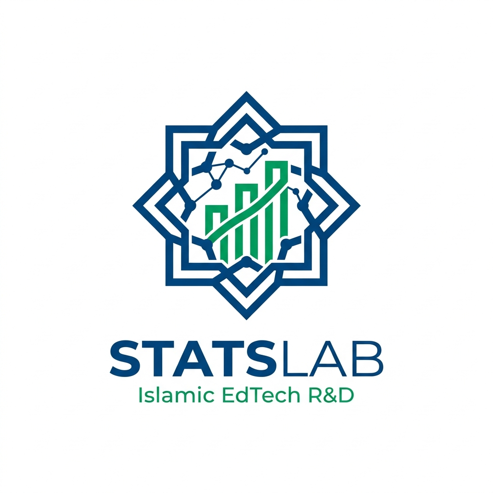
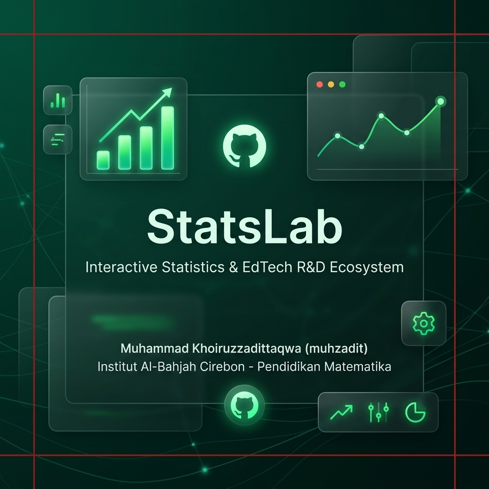
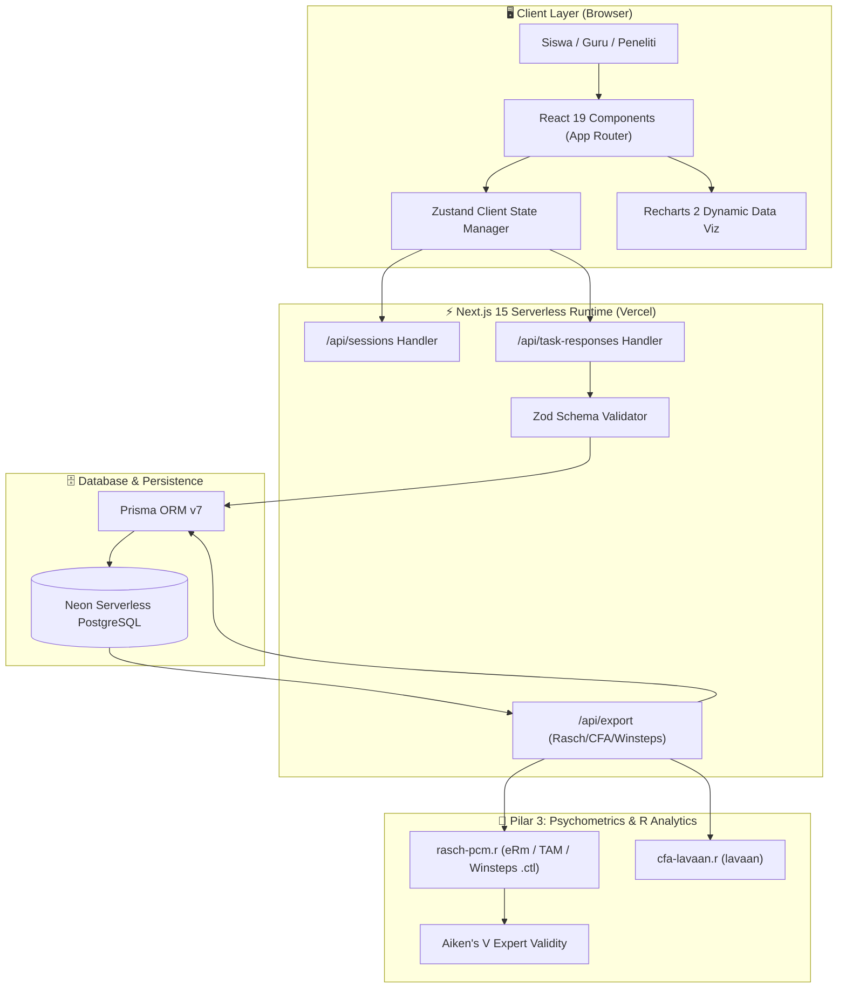

<a id="readme-top"></a>

<!-- HERO / HEADER SECTION -->
<div align="center">
  <a href="https://statslabmedia.vercel.app">
    
  </a>

  <h1>StatsLab</h1>

  <p align="center">
    <strong>Media Pembelajaran Dasbor Statistik Interaktif & EdTech R&D Ecosystem Terintegrasi Nilai Keislaman</strong>
    <br />
    <em>Learning Analytics Infrastructure & Data Literacy Research Platform (Watson-Callingham Hierarchy Level 1–6)</em>
  </p>

  <p align="center">
    <a href="https://statslabmedia.vercel.app"><strong>⚡ Jelajahi Live Demo</strong></a> •
    <a href="https://github.com/zaditprodakwah/statslab/issues/new?labels=bug">🐛 Laporkan Bug</a> •
    <a href="https://github.com/zaditprodakwah/statslab/issues/new?labels=enhancement">✨ Usulkan Fitur</a> •
    <a href="#-sitasi-akademik--citation">🎓 Sitasi Penelitian</a>
  </p>

  <!-- SHIELDS.IO BADGES -->
  <p align="center">
    <a href="https://github.com/zaditprodakwah/statslab/graphs/contributors"></a>
    <a href="https://github.com/zaditprodakwah/statslab/network/members"></a>
    <a href="https://github.com/zaditprodakwah/statslab/stargazers"></a>
    <a href="https://github.com/zaditprodakwah/statslab/issues"></a>
    <a href="https://statslabmedia.vercel.app"></a>
    <a href="LICENSE"></a>
  </p>

  <!-- AUTHOR ACADEMIC BADGES -->
  <p align="center">
    <a href="https://orcid.org/0000-0002-1594-9548"></a>
    <a href="https://scholar.google.com/citations?user=CbR250MAAAAJ"></a>
    <a href="https://independent.academia.edu/muhzadit"></a>
  </p>

  <!-- HERO BANNER VISUAL -->
  <p align="center">
    
  </p>
</div>

---

<!-- TABLE OF CONTENTS -->
<details>
  <summary>📌 <strong>Daftar Isi (Table of Contents)</strong></summary>
  <ol>
    <li><a href="#-tentang-proyek">Tentang Proyek</a></li>
    <li><a href="#-fitur-utama-feature-grid">Fitur Utama (Feature Grid)</a></li>
    <li><a href="#-arsitektur-sistem-mermaidjs">Arsitektur Sistem (Mermaid.js)</a></li>
    <li><a href="#-repository-pulse--statistics">Repository Pulse & Statistics</a></li>
    <li><a href="#-struktur-folder-monorepo">Struktur Folder Monorepo</a></li>
    <li><a href="#-panduan-instalasi--pengembangan-lokal">Panduan Instalasi & Pengembangan Lokal</a></li>
    <li><a href="#-publikasi--karya-ilmiah-terbaru">Publikasi & Karya Ilmiah Terbaru</a></li>
    <li><a href="#-sitasi-akademik--citation">Sitasi Akademik (Citation)</a></li>
    <li><a href="#-kontributor-repositori">Kontributor Repositori</a></li>
    <li><a href="#-kontribusi--kode-etik">Kontribusi & Kode Etik</a></li>
    <li><a href="#-lisensi">Lisensi</a></li>
    <li><a href="#-peneliti-utama">Peneliti Utama</a></li>
  </ol>
</details>

---

## 📖 Tentang Proyek

**StatsLab** adalah repositori R&D (*Research & Development*) EdTech *open source* berbasis keislaman pertama di Indonesia. Proyek ini dirancang dan dikembangkan oleh **Muhammad Khoiruzzadittaqwa (muhzadit)** dari Program Studi **Pendidikan Matematika**, **Institut Al-Bahjah Cirebon**.

StatsLab menggabungkan visualisasi data interaktif Next.js 15 dengan integrasi nilai-nilai etika Keislaman (*Amanah*, *Tabayyun*, *Tawazun*), asesmen literasi data Watson-Callingham (Level 1–6), instrumen kepraktisan adaptif System Usability Scale (SUS 14-butir), serta pustaka analisis psikometri terbuka (Rasch PCM & CFA R scripts).

<p align="right">(<a href="#readme-top">back to top</a>)</p>

---

## ✨ Fitur Utama (Feature Grid)

<table width="100%">
  <tr>
    <td width="50%" valign="top">
      <h3>🤝 Pilar Amanah (QS. Al-Mutaffifin: 1-3)</h3>
      <p>Sakelar audit visual skala sumbu Y (<em>Zero-Based vs Truncated Y-Axis</em>) untuk melatih ketelitian dan kejujuran membaca grafik data.</p>
    </td>
    <td width="50%" valign="top">
      <h3>🔍 Pilar Tabayyun (QS. Al-Hujurat: 6)</h3>
      <p>Deteksi pencilan data/outlier otomatis (&gt;20% dari median) dilengkapi modal verifikasi data untuk melatih kritis membaca data.</p>
    </td>
  </tr>
  <tr>
    <td width="50%" valign="top">
      <h3>⚖️ Pilar Tawazun (QS. Al-Infitar: 7)</h3>
      <p>Indikator keseimbangan distribusi data kuantitatif perbandingan <em>Mean vs Median</em> untuk menganalisis simetri data.</p>
    </td>
    <td width="50%" valign="top">
      <h3>📊 8 Embedded Tasks Watson-Callingham</h3>
      <p>Asesmen literasi data berjenjang dari Level 4 (<em>Reading Data</em>), Level 5 (<em>Reading Between</em>), hingga Level 6 (<em>Data-Driven Decision Making</em>).</p>
    </td>
  </tr>
  <tr>
    <td width="50%" valign="top">
      <h3>🧪 Psikometri Open Science (Rasch & CFA)</h3>
      <p>Infrastruktur ekspor data matriks <code>.csv</code> dan file kontrol Winsteps (<code>.ctl</code>) dengan R scripts (<code>eRm</code>, <code>TAM</code>, <code>lavaan</code>).</p>
    </td>
    <td width="50%" valign="top">
      <h3>🏆 Sertifikat Digital & Evaluasi SUS 14</h3>
      <p>Penilaian politomi otomatis (0, 1, 2), kuesioner SUS 14-butir adaptif, dan penerbitan sertifikat digital otomatis ber-confetti.</p>
    </td>
  </tr>
</table>

<p align="right">(<a href="#readme-top">back to top</a>)</p>

---

## 🏛 Arsitektur Sistem (Mermaid.js)



<p align="right">(<a href="#readme-top">back to top</a>)</p>

---

## 📈 Repository Pulse & Statistics

<p align="center">
  
  
  
  
</p>

<p align="right">(<a href="#readme-top">back to top</a>)</p>

---

## 📂 Struktur Folder Monorepo

```text
STATSLAB/
├── apps/
│   └── web/                         # Next.js 15 Web Application Core
│       ├── prisma/                  # Schema Prisma v7 & Script Seed DB
│       ├── public/                  # Asset Statis (social-preview.png, llms.txt, robots.txt, sitemap.xml)
│       └── src/
│           ├── app/                 # Next.js App Router (Pages & API Routes)
│           ├── components/          # Reusable UI & Chart Components
│           └── lib/                 # Utilities, Zod Schemas, & Prisma Client
├── packages/
│   ├── analysis/                    # Skrip R Psikometri & Open Science
│   │   └── scripts/
│   │       ├── cfa-lavaan.r         # Analisis Faktor Konfirmatori (lavaan)
│   │       └── rasch-pcm.r          # Model Rasch Partial Credit (eRm & TAM)
│   ├── datasets/                    # Datasets JSON Mentah (Zakat, Wakaf, Tajwid, Perpus)
│   └── rubrics/                     # Rubrik Penilaian Politomi & Kuesioner SUS
├── .github/                         # Workflows GitHub Actions, SECURITY.md
├── CITATION.cff                     # Citation File Format v1.2.0 (ORCID & Google Scholar)
├── .zenodo.json                     # Metadata DOI Otomatis Zenodo
├── codemeta.json                    # Schema Software Science Metadata
├── llms.txt                         # Directive AI Agents & LLM Search Engines
├── vercel.json                      # Konfigurasi Deployment Vercel Monorepo
├── package.json                     # Root NPM Workspaces Configuration
└── README.md                        # Dokumen Utama Repositori
```

<p align="right">(<a href="#readme-top">back to top</a>)</p>

---

## 🚀 Panduan Instalasi & Pengembangan Lokal

<details>
  <summary>💻 <strong>Klik untuk Membuka Panduan Setup & Instalasi Langkah Demi Langkah</strong></summary>

<br />

### Prasyarat
- **Node.js**: `v24.x` atau lebih baru
- **NPM**: `v10.8.2` atau lebih baru
- **Database**: PostgreSQL (direkomendasikan Neon PostgreSQL Serverless)
- **R Environment** *(Opsional, untuk Psikometri Pilar 3)*: R v4.x + paket `eRm`, `TAM`, `lavaan`.

### Langkah-Langkah

1. **Clone Repositori**:
   ```bash
   git clone https://github.com/zaditprodakwah/statslab.git
   cd statslab
   ```

2. **Instal Dependensi Monorepo**:
   ```bash
   npm install
   ```

3. **Konfigurasi Environment Variables**:
   Buat file `.env` pada `apps/web/.env` (atau salin dari `apps/web/.env.example`):
   ```env
   DATABASE_URL="postgresql://neondb_owner:YOUR_POOLER_URL/neondb?sslmode=require"
   DATABASE_URL_UNPOOLED="postgresql://neondb_owner:YOUR_DIRECT_URL/neondb?sslmode=require"
   ADMIN_TOKEN="GANTI_DENGAN_TOKEN_ACAK_ANDA"
   ```

4. **Generate Prisma Client & Seed Database**:
   ```bash
   npm run postinstall --workspace=apps/web
   cd apps/web && npx tsx prisma/seed.ts && cd ../..
   ```

5. **Jalankan Development Server**:
   ```bash
   npm run dev
   ```
   Akses aplikasi web di `http://localhost:3000`.

</details>

<p align="right">(<a href="#readme-top">back to top</a>)</p>

---

## 📚 Publikasi & Karya Ilmiah Terbaru

<!-- PUBLICATION_LIST:START -->
<!-- PUBLICATION_LIST:END -->

<p align="right">(<a href="#readme-top">back to top</a>)</p>

---

## 🎓 Sitasi Akademik (Citation)

Jika Anda menggunakan perangkat lunak, dataset, atau skrip psikometri **StatsLab** dalam penelitian Anda, mohon sitasi repositori ini melalui tombol **"Cite this repository"** di bagian samping kanan repositori GitHub ini, atau gunakan format BibTeX berikut:

```bibtex
@software{Khoiruzzadittaqwa_StatsLab_2026,
  author = {Khoiruzzadittaqwa, Muhammad},
  title = {{StatsLab: Dasbor Statistika Interaktif \& EdTech R\&D Ecosystem Terintegrasi Nilai Keislaman}},
  url = {https://github.com/zaditprodakwah/statslab},
  institution = {Institut Al-Bahjah Cirebon},
  department = {Pendidikan Matematika},
  year = {2026}
}
```

<p align="right">(<a href="#readme-top">back to top</a>)</p>

---

## 👥 Kontributor Repositori

Terima kasih kepada seluruh kontributor yang telah membantu membangun ekosistem ini:

<!-- CONTRIBUTORS-LIST:START -->
<p align="center">
  <a href="https://github.com/zaditprodakwah/statslab/graphs/contributors">
    
  </a>
</p>
<!-- CONTRIBUTORS-LIST:END -->

<p align="right">(<a href="#readme-top">back to top</a>)</p>

---

## 🤝 Kontribusi & Kode Etik

Kami menyambut kontribusi dari peneliti, pendidik, dan pengembang perangkat lunak! 

- Silakan baca **[CONTRIBUTING.md](CONTRIBUTING.md)** untuk panduan berkontribusi.
- Semua partisipan diharapkan mematuhi **[CODE_OF_CONDUCT.md](CODE_OF_CONDUCT.md)**.

<p align="right">(<a href="#readme-top">back to top</a>)</p>

---

## 📜 Lisensi

Proyek ini dilindungi oleh **Model Lisensi Ganda**:
1. **MIT License**: Seluruh *source code* aplikasi web (`apps/web/`).
2. **Creative Commons Attribution 4.0 International (CC-BY 4.0)**: Dataset (`packages/datasets/`), rubrik asesmen, dan skrip psikometri (`packages/analysis/`).

Informasi selengkapnya dapat dibaca pada berkas **[LICENSE](LICENSE)**.

<p align="right">(<a href="#readme-top">back to top</a>)</p>

---

## 📬 Peneliti Utama

**Muhammad Khoiruzzadittaqwa (muhzadit)**  
Program Studi Pendidikan Matematika — **Institut Al-Bahjah Cirebon**

- **Email**: `muhzadit@gmail.com`
- **GitHub**: [@zaditprodakwah](https://github.com/zaditprodakwah)
- **ORCID**: [0000-0002-1594-9548](https://orcid.org/0000-0002-1594-9548)
- **Google Scholar**: [Muhammad Khoiruzzadittaqwa](https://scholar.google.com/citations?user=CbR250MAAAAJ)
- **Academia.edu**: [muhzadit](https://independent.academia.edu/muhzadit)

<p align="center">
  <strong>StatsLab R&D Ecosystem</strong> • Institut Al-Bahjah Cirebon
</p>

<p align="right">(<a href="#readme-top">back to top</a>)</p>
